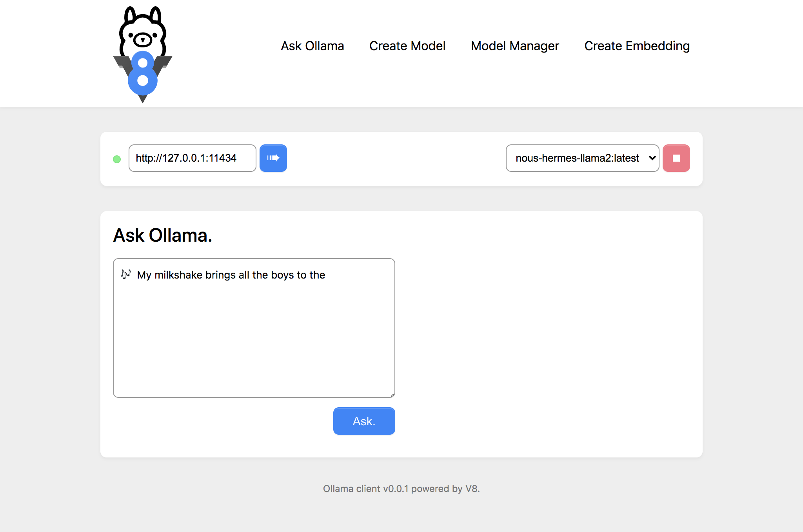

## A small interface exploring the API endpoints.



This is incomplete but will be updated asap. \
Currently only the `Ask Ollama` page exists. The others will be added.

<hr />

### How to run it:

1. Clone this directory or copy the files.
2. Start a webserver that can serve static files (any webserver will work).

<hr />

#### Example on how to start a simple webserver:
```bash
python3 -m http.server --bind 127.0.0.1 11435
```
